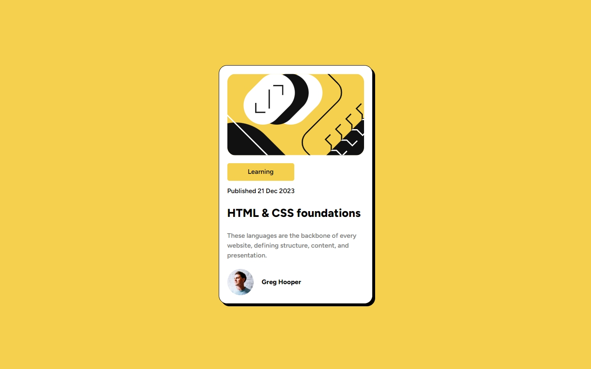
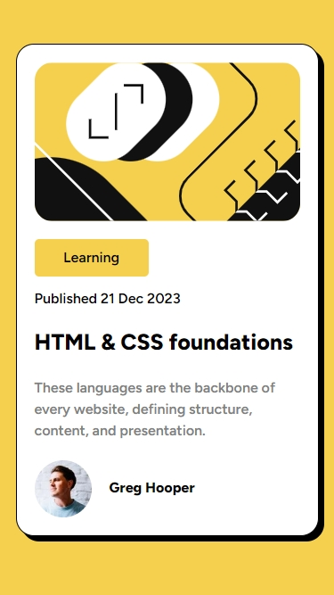

# Frontend Mentor - Blog preview card solution

This is a solution to the [Blog preview card challenge on Frontend Mentor](https://www.frontendmentor.io/challenges/blog-preview-card-ckPaj01IcS). Frontend Mentor challenges help you improve your coding skills by building realistic projects. 

## Table of contents

- [Overview](#overview)
  - [The challenge](#the-challenge)
  - [Screenshot](#screenshot)
  - [Links](#links)
- [My process](#my-process)
  - [Built with](#built-with)
  - [What I learned](#what-i-learned)
  - [Continued development](#continued-development)
  - [Useful resources](#useful-resources)
- [Author](#author)
- [Acknowledgments](#acknowledgments)

**Note: Delete this note and update the table of contents based on what sections you keep.**

## Overview
This is a project that I really enjoyed doing. I really liked doing the ':hover' in all of the elements I considered important and I would like to do a challenge like this in the future.

### The challenge

Users should be able to:

- See hover and focus states for all interactive elements on the page ✅

### Screenshot




### Links

- Solution URL: [Add solution URL here](https://your-solution-url.com)
- Live Site URL: [Add live site URL here](https://your-live-site-url.com)

## My process
I first started labeling all of the elements that were in the HTML so that I could recognize and organize them more easily. Then, I created my stylesheet along with a normalize file. Then I worked on the box and learned from my mistakes from the last exercise I did (the QR one), worked on the overall design of the card and then on the hover actions. I felt really satisfied with the result.

### Built with

- VSCode (for writing code)

### What I learned
I learned that with enough practice and learning more, you can develop certain abilities that can help you with these kinds of projects. I also learned that you can transition font sizes.

```css
.font-size-change {
  font-size: 16px;
  transition: font-size .5s ease 0s;
}
.font-size-change {
  font-size: 20px
}
```
### Continued development
I will work on more of these projects to delevop my web developing skills.

## Author

- Frontend Mentor - [@Merme-Github](https://www.frontendmentor.io/profile/Merme-GitHub)
- Twitter - [@MermeCoding](https://www.twitter.com/MermeCoding)

